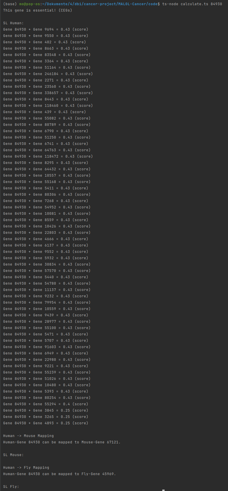
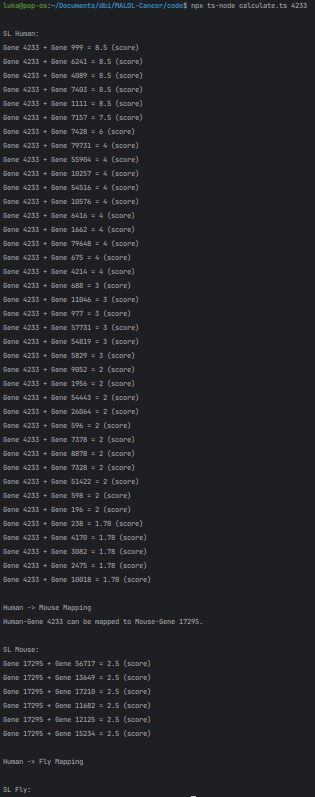

= MALOL-Cancer

== Team M~oritz~A~rmin~L~inus~O~liver~L~uka~

Moritz Gruber, Armin Salkovic, Linus Nestler,  Oliver Daxinger, Luka Cvijic

== Documentation

=== Spezien

* Mensch
* Maus
* Fliege

=== Angabe

* Gen x (Mensch) verursacht im Menschen Krebs.
* Dieses wird an die DB geschickt. Die DB schaut, ob es dieses Gen x in einem Tier gibt.
* Wenn ja, schaut man welche TierGenCombo {Gen x (im Tier) : Gen b} bei Tieren die höchste Letalitätsrate hat.
* So hat man Genpaare: {MausGen x ; MausGen b ; Lethality} -> Man schaut beim Tier-Human-Mapping, welches Gen im Mensch dem MausGen b entspricht.
* Dann hat man die Gene im Menschen, die den Genen der Maus entsprechen, die das anfangs gen x auslöschen.
* Man muss noch schauen, ob diese Menschen-Gene für den Mensch essenziell sind.
* Wenn nicht, kann man annehmen, dass das Gen x im Menschen durch ein Gen (Das in der Maus eine Zelle auslöscht) auch im Menschen eine Zelle auslöscht.

=== IDs Mapping

* Oma Seite:  entrez Gen Id(Mapping) stimmen mit den Id's HumanSL / FlySL / MouseSL überein
* Die ncbi_id der essential Gene passen mit den anderen überein.

== Gelöschte Daten

Spalten aus den Originalen Daten die für uns unnötig sind

Bei Spezies:

* r.cell_line -> immer null
* r.pubmed_id  -> Id des Papers das die Lethality herausgefunden hat
* r.source -> Quelle unnötig

Mappings:

* Relationen(1:1 1:m ...) wird nicht benötigt, die gene sind mehrmals da
* Spalte nach Relationen ist unnötig
* Daten wie z. B. HUMAN1234 oder MOUSE1234
werden ignoriert

Essential

* esembl -> unnötig

Criteria used for classifying CSEGs and CEGs:

* CSEGs - Genes tested in more than 10 cell lines and essential in only one particular cancer.
* CEGs - Genes essential in 80% or more tested cell lines.

== ERD

image::http://www.plantuml.com/plantuml/proxy?cache=no&src=https://raw.githubusercontent.com/Linus-69420/MALOL-Cancer/main/plantuml/erd.puml[]

== Datenbank

Wir haben uns für SQLite entschieden, weil die Anzahl an Daten nicht den Rahmen sprengt und
es einfach ist in einer Gruppe an SQL-Lite zu arbeiten.

== Daten Verarbeiten

Wir benutzen Typescript um die Daten in unsere Datenbank einzuspielen und auch um Abfragen durchzuführen.

=== Create Statements

[source, sql]
----
include::databaseQueries/createTables.sql[]
----

== Score

== Get Started

* At first, you have to install the dependencies in the src folder.
[source, bash]
----
npm install
----

* Now you have to do following command.
[source, bash]
----
npm start
----

* Enter your GeneId and you can look at the results. We recommend to try the GeneId 1856.

== Gene-Inputs

* 84930

* 4233

== Description for Typescript Files

* insertEssentialyHuman
** inserts data from CSEGs_CEGs.csv into the database (table: Gene)
* calculate
** calculates the score
* insertMappingData
** inserts mapping-data from human-fly-gene-mapping.csv and human-mouse-gene-mapping.csv
into the database (table: MappingData)
* insertSLData
** inserts sl-data from Human_SL.csv, Fly_SL.csv and Mouse_SL.csv into the database
(table: GenePairSL)

